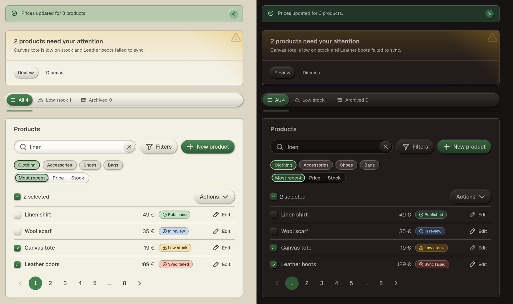

# Relievo

A React design system with a tactile look: controls stand out in relief, fields are carved into the page, and the state of each control reads from its shape as much as from its color. Built on [Base UI](https://base-ui.com/) (unstyled, accessible primitives), written in TypeScript, styled with Sass CSS Modules and CSS custom-property tokens, and documented with Storybook.



- **Accessible by construction.** Behaviour and keyboard handling come from Base UI. Text reaches 4.5:1 contrast in both themes, selection never relies on color alone, and every accessibility contract has a test.
- **Light and dark**, following the OS or set by the app, with no flash on first paint.
- **Consistent props everywhere:** `tone`, `variant` and `size` mean the same on every component.
- **Opinionated on purpose.** Components take no `className`, `style` or `render`: customisation goes through variants, sizes and tokens, so an app cannot drift from the kit.
- **Controlled or uncontrolled**, for every stateful component.
- **Server Components friendly**, dot notation included (`<Card.Body>`).

## Status

Early stage (0.1.x): the API can still change between versions, and the package is not published to npm yet. The planned work is in [`docs/backlog.md`](docs/backlog.md).

## Installation

```bash
pnpm add relievo @phosphor-icons/react
```

`react` and `react-dom` (19+) are peer dependencies, like `@phosphor-icons/react`, the icon set used by the components and recommended for yours.

## Usage

Import the stylesheet once, at the root of your app:

```tsx
import { Button } from 'relievo';
import 'relievo/styles.css';

<Button variant="primary" size="md">Save</Button>;
```

See [Theming](#theming-light--dark) for light and dark mode and [Router links](#router-links) to use your router's link component.

To browse every component with its props, run Storybook locally (`pnpm storybook`, see [Development](#development)). The "All components" story of the Overview shows them together on a realistic screen.

## Components

| Component | Purpose |
| --- | --- |
| `Box` | Generic container: padding, margin, optional border, element (`as`) |
| `Stack` | Children in a column or a row: gap, alignment, separators, wrap, element (`as`, lists included) |
| `Button` | Actions; `href` renders it as a link; `startIcon` / `endIcon` |
| `ButtonGroup` | Related buttons on a single line, with a fixed gap |
| `Card` | A flat panel grouping related content, with an optional `tone` (and its corner icon) and an `outline` variant: `Card.Header` (`Card.Title`, `Card.Description`), `Card.Body`, `Card.Footer` |
| `Alert` | A message in the flow of the page (`tone`, `title`, an icon, an optional close button) |
| `Link` | A link in running text: inherits the type around it, `tone`, `external` |
| `Checkbox` | A single yes / no choice, with a mixed state |
| `Input` | Single-line text field with label, helper text, error, icons, prefix / suffix, an end action (`Input.Action`: clear, show password) or a button beside it |
| `Textarea` | Multi-line text field, the same carved field as `Input` |
| `Menu` | A secondary button opening a list of actions: groups, separators, submenus, checkable items |
| `Pagination` | Previous / next and page numbers, as buttons or links |
| `Chip` | Tags and statuses (static), or selectable toggles |
| `Chip.Group` | Filters: several choices among chips |
| `Segmented` | A single choice among a few short options (radio group) |
| `Tabs` | A bar of tabs over the content they show: `Tabs.List`, `Tabs.Item` (icon), `Tabs.Panel` (`plain` or `framed`) |
| `Select` | A single choice among a long list (`Select.Item` children or an `options` array) |
| `Collapsible` | A section whose content (`children`) shows or hides on click, under its `label` |
| `Spinner` | An action in progress, as a spinning ring; drop it anywhere an icon is expected, such as `startIcon` |
| `ThemeProvider`, `useTheme` | Light / dark / system mode |
| `RelievoProvider` | App-level configuration (router link component) |

## Design rules

Components do not accept `className`, `style` or Base UI's `render` prop: their look is owned by the design system and changed through variants, sizes and tokens only. Use `href` to render a `Button` as a link.

Every component follows the same conventions, listed in [`AGENTS.md`](AGENTS.md) (also the reference for AI coding agents).

## Typeface

The kit uses [Geist](https://vercel.com/font) through `@fontsource-variable/geist`, a dependency imported by the package entry. Your bundler emits the font files (about 30 KB for Latin, all weights in one variable file); nothing to configure. Until the font loads, text falls back to the system font.

## Router links

Components that take an `href` render a native `<a>` by default. To use your router's link, pass it once to `RelievoProvider` at the app root. It must forward its props, including `className`, to the rendered `<a>`.

```tsx
// Next.js (App Router): app/providers.tsx
'use client';
import Link from 'next/link';
import { RelievoProvider } from 'relievo';

export function Providers({ children }: { children: React.ReactNode }) {
  return <RelievoProvider linkComponent={Link}>{children}</RelievoProvider>;
}
```

For routers whose link takes another prop than `href` (React Router's `to`), pass a small adapter:

```tsx
const RouterLink = ({ href, ...props }: LinkComponentProps) => <Link to={href} {...props} />;
```

The components are client components, and can be imported from Server Components, dot notation included (`<Card.Body>`).

## Theming (light / dark)

Wrap your app in `ThemeProvider`. `defaultMode` is `"system"` (follow the OS preference, the default), `"light"` or `"dark"`:

```tsx
import { ThemeProvider } from 'relievo';

<ThemeProvider defaultMode="system">
  <App />
</ThemeProvider>;
```

To own the mode yourself (to persist it, for example), control it with `mode` and `onModeChange`. Read the stored value in an effect rather than in the initial state: reading it eagerly would return a different mode on the server (no `localStorage`) and on the client's first render, which React flags as a hydration mismatch wherever the mode reaches the rendered output (a menu label showing the mode, for example):

```tsx
const [mode, setMode] = useState<ThemeMode>('system');

useEffect(() => {
  const stored = localStorage.getItem('theme');
  if (stored === 'light' || stored === 'dark' || stored === 'system') setMode(stored);
}, []);

<ThemeProvider
  mode={mode}
  onModeChange={(next) => {
    localStorage.setItem('theme', next);
    setMode(next);
  }}
>
  <App />
</ThemeProvider>;
```

That still flashes the OS default for a moment before the effect runs. To avoid it, render `ThemeScript` in `<head>`, ahead of the app: it is a blocking script, so it sets `data-theme` before the first paint, independently of when React hydrates:

```tsx
import { ThemeScript } from 'relievo';

<head>
  <ThemeScript storageKey="theme" />
</head>;
```

`storageKey` must match what `onModeChange` writes above (it defaults to `'theme'`). It only ever sets `data-theme`, never removes it: for `system`, or when nothing is stored yet, the server already renders with no `data-theme`, which is already correct.

Read or change the mode anywhere inside it with `useTheme()`:

```tsx
const { mode, resolvedMode, setMode } = useTheme();
```

The provider sets `data-theme` on `<html>`, so portalled popups are themed too. In `system` mode it removes the attribute and the CSS follows `prefers-color-scheme`. Render a single provider at the app root. To force a theme for one section, set the attribute directly:

```html
<section data-theme="dark">Always dark here</section>
```

In Storybook, switch modes from the toolbar.

## Development

| Command                | Description                                   |
| ---------------------- | --------------------------------------------- |
| `pnpm storybook`       | Start Storybook at http://localhost:6006      |
| `pnpm build-storybook` | Build a static Storybook to `storybook-static` |
| `pnpm build`           | Build the library to `dist/` (ESM + types + CSS) |
| `pnpm typecheck`       | Type-check the project                        |
| `pnpm test`            | Run the unit tests (Vitest + Testing Library) |
| `pnpm test:watch`      | Run the unit tests in watch mode              |

The project layout:

```
src/
  index.tsx             # package entry: re-exports client.ts, rebuilds compound components
  client.ts             # the kit (built as a 'use client' module)
  components/<Name>/    # component, Sass CSS Module (*.module.scss), stories, tests, index
  theme/                # ThemeProvider and useTheme
  provider/             # RelievoProvider (router link)
  internal/             # shared internals (IconSlot)
  utils/                # useControllableState
  styles/tokens.scss    # design tokens (--rv-*), light/dark palettes, relief tokens
  styles/_*.scss        # shared Sass mixins (control sizes, icons, typography, a11y)
  styles/global.scss    # global element styles (html font size, body colors, scroll behavior)
  overview/             # a story using every component together
  test/                 # test setup and mocks
docs/
  contributing.md       # recipes for contributors (visual captures)
  theming.md            # plan for app-chosen colors
  backlog.md            # planned work and open points
```

## Contributing

Read [`AGENTS.md`](AGENTS.md) for the conventions and [`docs/contributing.md`](docs/contributing.md) for the recipes. Run `pnpm typecheck`, `pnpm test` and `pnpm build` before opening a pull request. For a design decision, open an issue to discuss the options first.

## License

[MIT](LICENSE) © Nicolas Challeil (aka STuFF)
